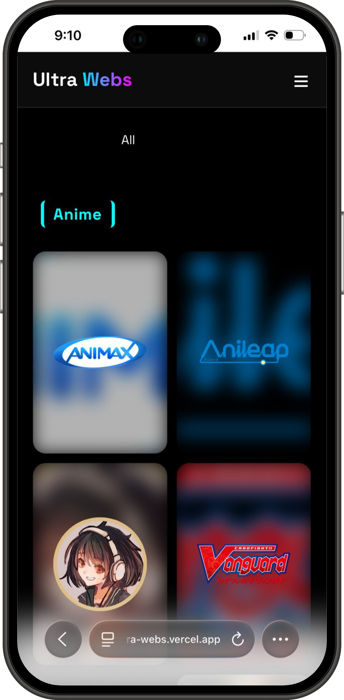
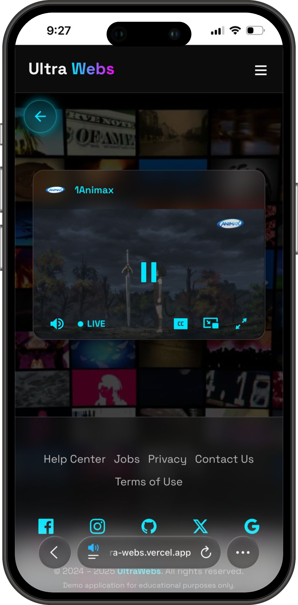
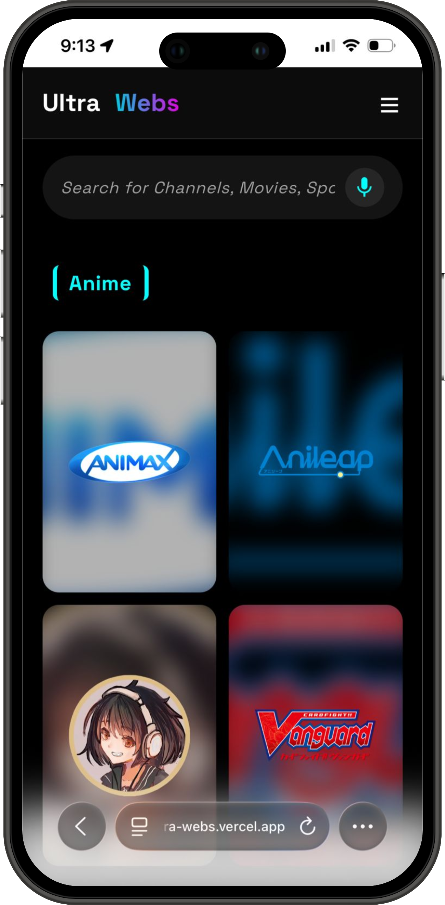
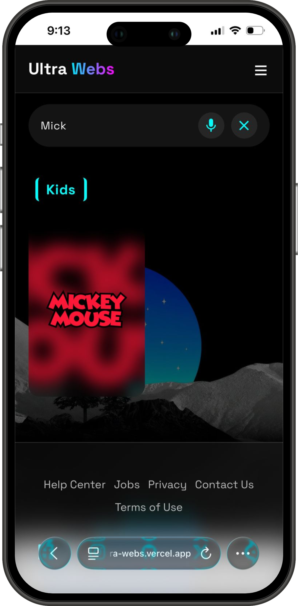
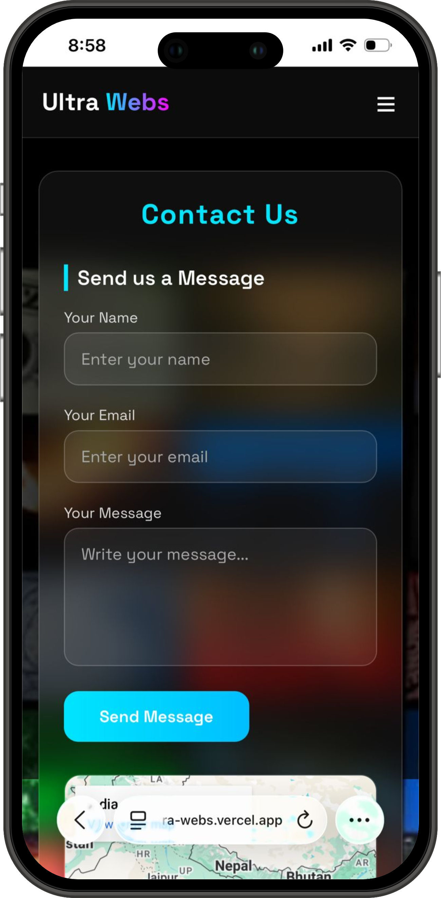
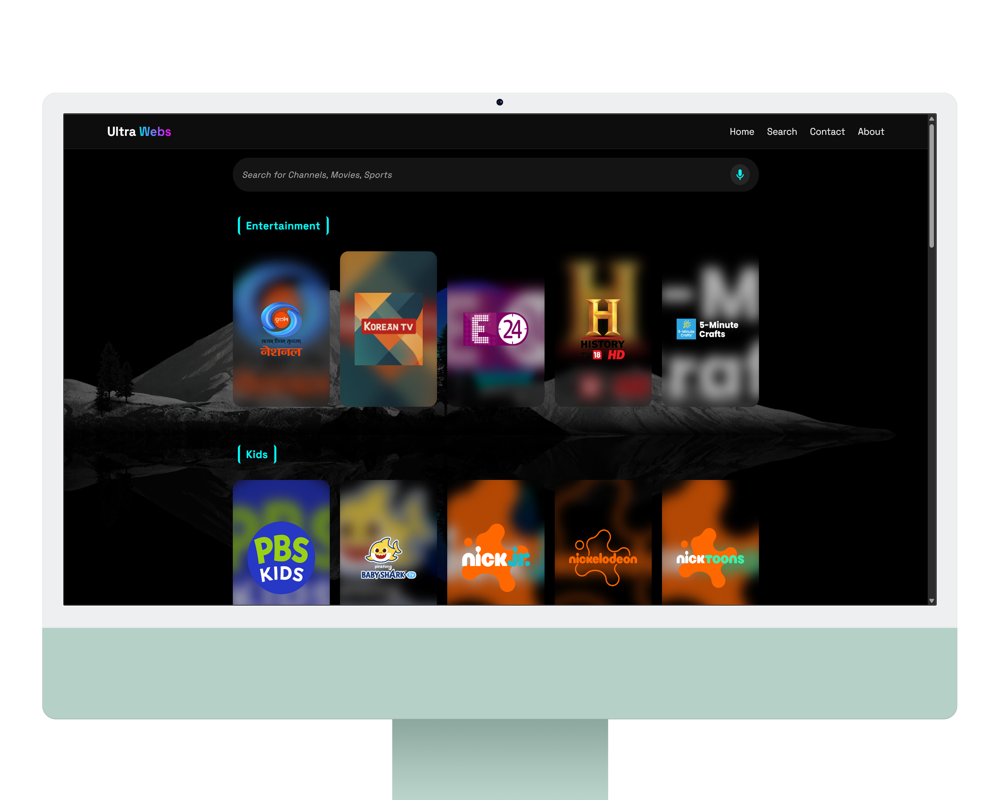
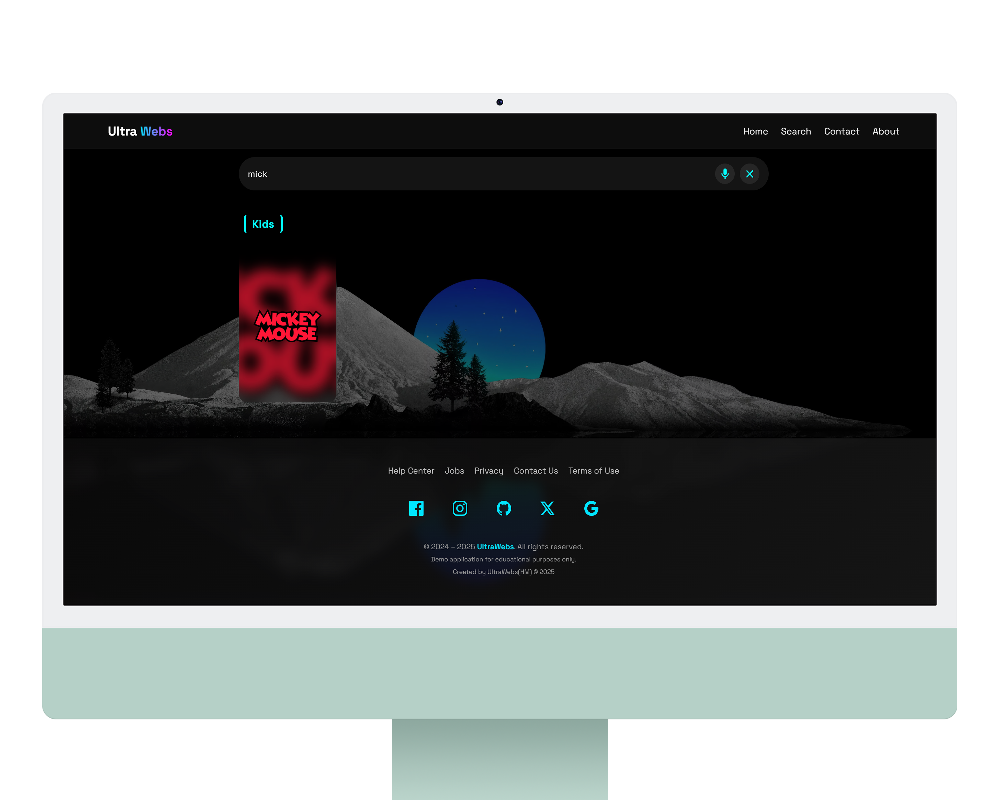

# UltraWebs

<p align="center">  </p> <p align="center"> UltraWebs is a lightweight multipage static web project built with <b>HTML</b>, <b>CSS</b>, and <b>JavaScript</b>. Designed for flexibility and reusability, it’s ideal for modern content-focused websites. <br><br> 🌐 <a href="https://ultra-webs.vercel.app" target="_blank">Live Demo</a> </p>

---

## 📑 Table of Contents

- [Introduction](#introduction)
- [Project Structure](#project-structure)
- [Installation](#installation)
- [Usage](#usage)
- [Features](#features)
- [Configuration](#configuration)
- [Deployment](#deployment)
- [Screenshots](#screenshots)
- [Troubleshooting](#troubleshooting)
- [Contributors](#contributors)
- [License](#license)

---

## 🚀 Introduction

UltraWebs is designed as a modular static site with reusable components such as headers, footers, and favicons.

It includes separate pages for navigation, searching, and media playback, making it a good starting point for customizable personal or content-focused websites.

---

## 📂 Project Structure

```
UltraWebs/
├── css/           # Stylesheets
├── js/            # JavaScript files
├── other/         # Additional assets/resources
├── favicon.html   # Favicon reference page
├── footer.html    # Footer component
├── header.html    # Header component
├── index.html     # Main landing page
├── player.html    # Media player page
├── search.html    # Search interface
```

---

## ⚙️ Installation

1. **Clone the repository**

   ```bash
   git clone https://github.com/redmigg12311-alt/UltraWebs.git
   cd UltraWebs
   ```

2. **Open in your browser**  
   Simply open `https://ultra-webs.vercel.app` in your preferred web browser.

---

## 🖥️ Usage

- Edit the HTML files to customize content.
- Modify styles inside the `css/` folder.
- Add or update functionality in the `js/` folder.
- Use `header` and `footer` as modular components to maintain consistency across pages.

---

## ✨ Features

- 📄 Multipage layout with reusable components
- 🎨 Customizable CSS and JavaScript structure
- 🔍 Dedicated search page
- 🎵 Player page for media integration
- 🌐 Deployed easily on Vercel

---

## ⚙️ Configuration

- Update `favicon` to configure your custom favicon.
- Modify navigation inside `header` for new pages.
- Place additional assets (e.g., images, fonts) inside the `other/` directory.

---

## 🌍 Deployment

UltraWebs is already deployed using [Vercel](https://vercel.com/).  
To deploy your own version:

1. Push the repo to your GitHub account.
2. Connect your repository to Vercel via the [Vercel dashboard](https://vercel.com/dashboard).
3. Configure build settings (for static sites, no build step is needed).
4. Deploy — your site will be live in seconds!

---

## 📱 Mobile

UltraWebs is fully responsive and adapts to different screen sizes, making it usable on smartphones and tablets.  
Here are some mobile previews (scroll →):

<p align="left" style="overflow-x: auto; white-space: nowrap;">
   &nbsp;&nbsp;&nbsp;&nbsp;
   &nbsp;&nbsp;&nbsp;&nbsp;
   &nbsp;&nbsp;&nbsp;&nbsp;
   &nbsp;&nbsp;&nbsp;&nbsp;
  
</p>

---

## 📸 Screenshots  

Here are previews of the main pages:  

<p align="center">
    
  <br><b>🏠 Home Page</b>
</p>

<p align="center">
    
  <br><b>🎵 Player Page</b>
</p>

<p align="center">
    
  <br><b>🔍 Search Page</b>
</p>

<p align="center">
    
  <br><b>📑 Search Output</b>
</p>

<p align="center">
    
  <br><b>📬 Contact-US Page</b>
</p>

---

## 🛠️ Troubleshooting

- CSS/JS not loading?  
  Ensure relative paths in `<link>` and `<script>` tags are correct.

- Broken links between pages?  
  Double-check file names and ensure case sensitivity matches (important for Linux servers).

---

## 👥 Contributors

- **[@redmigg12311-alt](https://github.com/redmigg12311-alt)** – Creator & Maintainer
